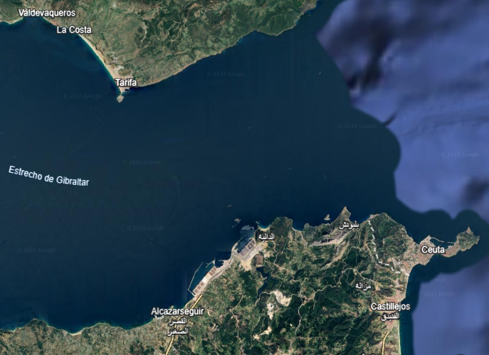

# Satellite Coastline Distance Analysis (Strait of Gibraltar)

Note: The notebooks and data processing scripts in this repository are written in Spanish.

This project focuses on calculating the minimum distance between two geographical coastlines (Spain and Morocco) using satellite imagery and data extraction techniques. It demonstrates how to transform visual information into coordinate-based data for mathematical analysis.

## Project Motivation

I created this project because **I am passionate about sharing my knowledge and teaching others**. I believe that explaining complex workflows—like turning a simple satellite capture into a precise distance measurement—is the best way to master the tools of data science and help others understand their practical applications.

## Methodology

The analysis follows a three-step technical workflow:

1.  **Data Acquisition:** A satellite image of the Strait of Gibraltar was used as the primary source.
2.  **Digitization:** Using **WebPlotDigitizer**, I manually traced the coastlines to export the visual paths into numerical datasets (`.csv` files).
3.  **Computational Analysis:** A Python notebook processes these coordinates to:
    * Clean and structure the raw CSV data using **Pandas**.
    * Visualize the extracted coastlines with **Matplotlib**.
    * Calculate the distance between points to find the geographical bottleneck.

## Repository Structure

* `coastline_distance_calculation.ipynb`: The main Python notebook containing the logic for data loading, visualization, and distance calculation.
* `costa_española.csv`: Digitized coordinates of the Spanish coastline.
* `costa_marroquí.csv`: Digitized coordinates of the Moroccan coastline.
* `costas_estrecho_gibraltar.png`: The original satellite reference image.
* 

## Tools Used

* **Python 3.x**
* **Pandas**: For data manipulation and cleaning.
* **NumPy & SciPy**: For numerical analysis and signal processing.
* **Matplotlib**: For plotting the geographical boundaries.
* **WebPlotDigitizer**: For converting image pixels into data points.

## Why this Project?

This repository serves as a practical example of:
* **Creative Data Sourcing:** How to get data when a public API or dataset is not available.
* **Geometrical Computing:** Implementing distance algorithms between two non-linear paths.
* **Educational Purpose:** A clear, step-by-step guide for students or enthusiasts interested in image-to-data workflows.

## Author
**Miquel Gelabert Mayol** - Design and data analysis
